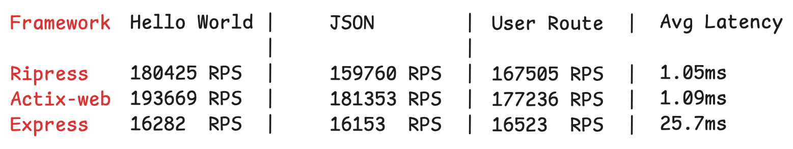

# Ripress

[](https://crates.io/crates/ripress)
[](LICENSE)

### An Express.js-inspired web framework for Rust

Please star the repo if you like it, so that I know someone is using it.

## What is Ripress?

Ripress is an Express.js-inspired web framework for Rust that combines the familiar developer experience of Express with the performance and safety of Rust. Built on top of [Hyper](https://hyper.rs) and [Tokio](https://tokio.rs), Ripress provides a simple and intuitive API for building fast, reliable web applications.

## Why Choose Ripress?

**🚀 Performance**

- Ripress is just ~6–7% slower than Actix-Web (one of the fastest Rust web frameworks), even though performance hasn’t been the main focus yet.
- Nearly 10x faster than Express.js

**💡 Developer Experience**

- Express.js-familiar API that Rust developers will love
- In many cases, even simpler than Express.js
- Comprehensive error handling and type safety

**⚡ Modern Foundation**

- Async/await support with Tokio
- HTTP/2 support via Hyper (enabled by default, configurable via `App::enable_http2` and `App::http2_config`)



## Table of Contents

- [Overview](#overview)
- [Features](#features)
- [Goals](#goals)
- [Installation](#installation)
- [Examples](#basic-example)
- [Documentation](#documentation)
- [Changelog](#changelog)

---

## Overview

Ripress is a web framework inspired by Express.js, designed to bring the familiar and intuitive Express.js developer experience to the Rust ecosystem while maintaining Rust's performance and safety guarantees.

## Features

- **Express-like routing** with `App` and `Router`
- **Async handler support** built on `tokio`
- **Pre and post middleware** for request/response processing
- **Built-in middleware** including CORS, logging, compression, and file uploads
- **Request/response objects** with JSON, text, and form parsing
- **Type-safe handler signatures** for better developer experience
- **WebSocket support** via the `wynd` crate (with "with-wynd" feature)
- **Extensible architecture** via custom middleware

### Optional Features

Ripress includes several optional features that can be enabled to reduce compile time and binary size:

- **`compression`** - Enables response compression middleware (gzip/deflate) using `flate2`
- **`file-upload`** - Enables file upload middleware for handling multipart form data using `uuid`
- **`logger`** - Enables request/response logging middleware using `tracing`
- **`with-wynd`** - Enables WebSocket support via the `wynd` crate

To enable features, add them to your `Cargo.toml`:

```toml
[dependencies]
ripress = { version = "*", features = ["compression", "file-upload", "logger", "with-wynd"] }
```

## Goals

- Provide an intuitive and simple API like Express.js
- Focus on developer experience first; performance optimizations will come later
- Prioritize ease of use over low-level control initially
- Include built-in middleware for common web development needs

---

## Getting Started

The easiest way to get started is with the HexStack CLI.

HexStack is a project scaffolding tool (similar to create-t3-app) that lets you spin up new Rust web projects in seconds. With just a few selections, you can choose:

Backend: Ripress, Wynd, or both

Frontend: React, Svelte, or none

Extras: Out-of-the-box HTTP + WebSocket support

This means you can quickly bootstrap a full-stack project (Rust backend + modern frontend) or just a backend-only Ripress/Wynd project.

To create a new project with Ripress:

```sh
hexstack new my-project --template ripress
```

Alternatively, you can create a new project manually by running the following commands:

```sh
cargo new my-project
cd my-project
cargo add ripress
cargo add tokio --features macros,rt-multi-thread
```

To enable optional features (compression, file upload, logger, WebSocket support):

```sh
cargo add ripress --features compression,file-upload,logger,with-wynd
```

This will create a new project with Ripress and all optional features enabled.

## Basic Example

```rust
use ripress::{
    app::{App, Http2Config},
    context::{HttpRequest, HttpResponse},
    types::RouterFns,
};

#[tokio::main]
async fn main() {
    let mut app = App::new();

    app.get("/", handler);

    // Optional: disable HTTP/2 and serve only HTTP/1.1
    // app.enable_http2(false);

    // Optional: advanced HTTP/2 tuning
    // app.http2_config(Http2Config {
    //     http2_only: false,
    //     max_concurrent_streams: Some(100),
    //     ..Default::default()
    // });

    app.listen(3000, || {
        println!("Server is running on port 3000");
    })
    .await;
}

async fn handler(_req: HttpRequest, res: HttpResponse) -> HttpResponse {
    res.status(200)
        .json(json!({"message": "Welcome to Ripress!"}))
}
```

### WebSocket Example

**Note**: This example requires the `with-wynd` feature to be enabled. See [Optional Features](#optional-features) for details.

```rust
use ripress::{app::App, types::RouterFns};
use wynd::wynd::Wynd;

#[tokio::main]
async fn main() {
    let mut app = App::new();
    let mut wynd = Wynd::new();

    // HTTP route
    app.get("/", |_, res| async move {
        res.ok().text("Hello, World!")
    });

    // WebSocket connection handler
    wynd.on_connection(|conn| async move {
        conn.on_text(|event, _| async move {
            println!("Received: {}", event.data);
        });
    });

    // Mount WebSocket at /ws path
    app.use_wynd("/ws", wynd.handler());

    app.listen(3000, || {
        println!("Server running on http://localhost:3000");
        println!("WebSocket available at ws://localhost:3000/ws");
    })
    .await;
}
```

View more basic examples in [Examples](./docs/example/) dir.
View full blown code examples [here](https://github.com/Guru901/ripress-examples).

## Middleware Example

**Note**: This example requires the `file-upload` feature to be enabled. See [Optional Features](#optional-features) for details.

```rust
use ripress::{
    app::App,
    middlewares::{file_upload::file_upload},
    types::RouterFns,
};

#[tokio::main]
async fn main() {
    let mut app = App::new();

    // Add middleware (pre and post)
    app.use_cors(None)                                    // Pre-middleware
        .use_pre_middleware("/upload", file_upload(None)) // Pre-middleware (requires file-upload feature)
        .use_post_middleware("/api/", |req, res| async {  // Post-middleware
            println!("API response logged: {} {}", req.method, req.path);
            (req, None)
        })
        .use_rate_limiter(None);                          // Pre-middleware

    app.listen(3000, || {
        println!("Server running on port 3000");
    }).await;
}
```

Learn more about middleware in the [Middleware Guide](./docs/guides/middleware.md).

## Get Started

Ready to build something amazing? Jump into our [Installation Guide](./installation) or explore the framework on [GitHub](https://github.com/guru901/ripress).

You can also check out the complete API documentation on [Docs.rs](https://docs.rs/ripress/latest/ripress/).

## Documentation

- [Getting Started Guide](./docs/getting-started.md)
- [Middleware Guide](./docs/guides/middleware.md)
- [WebSocket Guide](./docs/guides/websocket.md)
- [API Reference](./docs/api-reference/)

## Changelog

[View Changelog](./CHANGELOG.md)

## Contributing

We welcome contributions! Please see our [Contributing Guide](CONTRIBUTING.md) for details.

---

_Ripress v1.0.1 - Production Ready_ ✨
